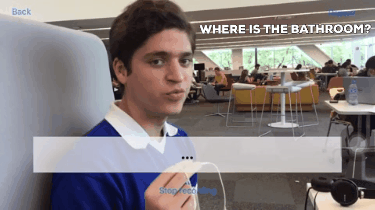

# ARTranslateApp

This app serves as a language translator. Its goal is to break the language barrier. Once it listens to foreign speech, it will translate it a chosen language and display the equivalent message to the user. It will display the text using Spritz reading so the user can read it faster in real time.

Use cases:
- Traveling
- Foreign students in an exchange program
- Meetings and debates
- Deaf people can use it to read what a person in saying aloud
- Foreign language courses/classrooms

This app is intended to be used on an augmented reality headset but for the meantime and for porject validation is has been developed as an iOS app since it is the area in which I have the most knowledge. It will soon be adapted to function with Google Cardboard and if I get a computer with Windows 10 I plan translate it to C# so it can run in Unity and in a Microsoft Hololens Emulator.

Possible means of distribution:
- Microsoft Hololens
- Standalone iOS app or made for Google Cardboard or other headsets
- Integrated in Skype or video chat

To use the app download the ZIP file and open the xcode workspace.
Before running the project you will need to enter a personal Google Api key in line 218.
Once it is done, run the project.
